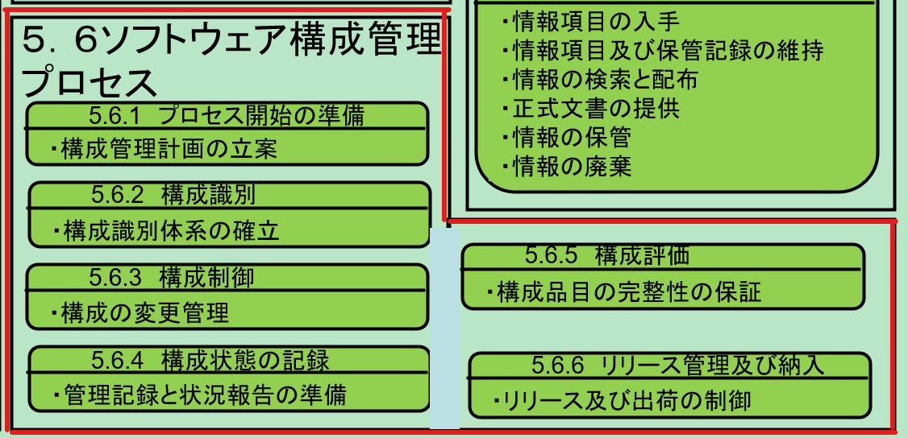

# ソフトウェア構成管理

## 規格/標準
* 共通フレーム2013
* 
* SWEBOK V3.0
* ISO

## 共通フレーム2013

[IPA共通フレーム2013](https://www.ipa.go.jp/sec/publish/tn12-006.html)

### 目的
ソフトウェア構成管理プロセスは、プロセス又はプロジェクトのソフトウェア品目の完整性(integrity)を確立し、維持すること、及びそれらを関係当事者が利用できるようにすることを目的とする。

* 補足
    * 完整性(Integrity)
        * 完全に整っていること、欠落なく全て揃っていること
        * → つまり、管理対象のコンポーネントが欠けることなく揃っており、開発プロセスの中で関係者がコンポーネントを利用できる状態を構築維持すること、が目的といえる。
  
### 成果
ソフトウェア構成管理プロセスの実施に成功すると次の状態になる。

- a) ソフトウェア構成管理戦略が作成されている。
    - TODO: What is ソフトウェア構成管理戦略
- b) プロセス又はプロジェクトによって生成される品目が識別され、定義され、ベースライン化されている。
    - TODO
- c) 品目の修正及びリリースが制御されている。
    - コンポーネントは様々な理由により修正が必要になる。この修正を勝手気ままに実行されることがないよう、修正の着手承認、変更結果の承認、リリース承認が管理プロセスとして定義され、実行管理されている状態を作ること。
- d) 関係当事者が修正及びリリースを利用できるようになっている。
    - 関係する開発者が上記の実行管理にアクセスできる状態になっている、つまり、コンポーネントを修正しリリースするための、ルールやツールが整備されている状態を作ること。
- e) 品目及び修正の状態が記録され、報告されている。
    - 修正状態が記録されていて、何が起因で、いつ、だれが、なにを、どう修正したか、を記録する。そして修正状態が
    - 状態記録は人手でやるには正確性を維持するための労力が大きいので、まずは構成管理ツールを利用しコンポーネントをリポジトリで管理することを考えたい。構成管理ツールを利用していれば、いつ、だれが、なにを、の修正状態はツールで記録がされる。これになぜを付加しており、ルールとセットでなぜ
- f) 品目の完全さ及び一貫性が確保されている。
    - あ
- g) 品目の保管、取扱い及び納入が制御されている
    - コンポーネントをどこに管理するのか、コンポーネントをテストしたり、リリースしたり

### アクティビティ及びタスク
プロジェクトは、ソフトウェア構成管理プロセスに関して、該当する組織の方針及び手順に従って、次のアクティビティを実施する

- 5.6.1 プロセス開始の準備
    - 5.6.1.1 構成管理計画の立案
      - 構成管理計画には次のことを記述する。構成管理計画は全体の管理計画の一部となることもある
          - 構成管理アクティビティ
              - 補足
              - 構成管理としてどんな活動をするのかを定義する
              - 構成管理業務フローとして活動を可視化するとわかりやすい
          - 構成管理アクティビティを遂行するための手順及びスケジュール
              - 補足
              - 手順書を準備する。たとえば、変更の起票や変更承認の手順だったり、ツールを使うための手順、リリース申請、承認の手順など
              - スケジュールとしては、リリーススケジュールだったり(テスト環境だったら、いつ締切で、いつリリースする)
          - 構成管理アクティビティを遂行するた責任を負う組織
              - 補足
              - 構成管理の遂行を計画し実行管理するチーム/グループを明確に定義する
              - プロジェクト管理グループだったり、ライブラリ管理グループ、など明確化する
          - ソフトウェア開発、保守などの他の組織との関係
              - 補足
              - 構成管理の活動に関連する組織、人を定義する
              - 構成管理アクティビティを業務フローとして定義して洗い出しすると網羅的になる
              - 具体的には構成管理ツールの提供チーム、変更を行う開発チーム、リリースを調整する相対や基盤グループなど
- 5.6.2 構成識別
    - 5.6.2.1 構成識別体系の確立
        - TODO
- 5.6.3 構成制御
    - 5.6.3.1 構成の変更管理
        - TODO
- 5.6.4 構成状態の記録
    - 5.6.4.1 管理記録と状況報告の準備
- 5.6.5 構成評価
    - 5.6.5.1 構成品目の完整性の保証
      - TODO: 機能的/物理的 かんさ 
      - 
- 5.6.6 リリース管理及び納入
    - 5.6.6.1 リリース及び出荷の制御

## SWEBOK

## ISO

## 長沢さんの定義
広義/狭義の定義がある

## Commands

* `mkdocs new [dir-name]` - Create a new project.
* `mkdocs serve` - Start the live-reloading docs server.
* `mkdocs build` - Build the documentation site.
* `mkdocs -h` - Print help message and exit.

## Project layout

    mkdocs.yml    # The configuration file.
    docs/
        index.md  # The documentation homepage.
        ...       # Other markdown pages, images and other files.
